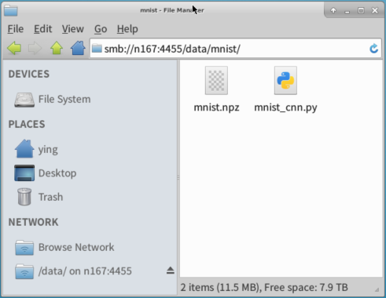

# GPU集群使用说明

2017-12-20
---

# 资源清单

|   机器名  | CPU核 | GPU |   内存   | SSD硬盘 | HDD硬盘 |
| -------- | ----- | --- | -------- | ------  | ------ |
| n167     | 20    | 2   | 124.6 GB | 180 GB  | 共8 TB |
| n168     | 20    | 2   | 124.6 GB | 180 GB  |        |
| n169     | 20    | 2   | 124.6 GB | 180 GB  |        |
| n170     | 20    | 2   | 124.6 GB | 180 GB  |        |

服务器：Dell PowerEdge R730
CPU：`Intel Xeon E5-2630 v4 @ 2.20GHz`，两个CPU，各10个物理核心，没有开启超线程
GPU：`NVIDIA GP102 [GeForce GTX 1080 Ti] (rev a1)`

# 服务地址

> 机器名`n167`的台机器作为Master。

|      服务      | 地址                   | 说明  | 
| -------------- | --------------------- | ----- |  
| Master         | http://n167:5050      | 查看集群状态，任务状态，以及任务XD`stdout`和`stderr`打印的输出 |
| Chronos        | http://n167:4400      | 提交和管理作业，查看作业状态。开启了HTTP Basic登录验证 |
| FTP文件服务     | ftp://n167            | 管理代码和数据文件 |
| Samba文件服务   | smb://n167:4455/data  | 管理代码和数据文件 |

> Chronos，FTP和Samba的 **用户名，密码** 请联系管理员。

# FTP和Samba文件服务
FTP和Samba文件服务对应的是各机器上的相同路径：`/gluster/volume2/data`。
这是集群中4台机器上的Gluster分布式文件系统，在各台机器上均可见，总容量为8 TB，**没有设置副本**。

对FTP，建议使用跨平台的 Filezilla 客户端。

对Samba文件服务，由于 **网络中心禁用445端口**，所以使用了`4455`端口，导致 **Windows系统无法访问**。
Linux系统安装Samba客户端：
```
sudo yum install -y samba-client cifs-utils # CentOS
sudo apt install -y smbclient    cifs-utils # Ubuntu
```

将Samba文件服务挂载到客户机的`/mnt-path`：
```
sudo mount -t cifs //n167/data /mnt-path -o user=<user>,pass=<pass>,port=4455
```

或写入客户机的`/etc/fstab`文件，以自动挂载：
```
//n167/data /mnt-path cifs user=<user>,pass=<pass>,port=4455,iocharset=utf8 0 0
```

> 挂载后，向`/mnt-path`添加的文件实际上是上传到了集群的Samba文件服务器。
> 强烈建议在客户机做好文件备份。
> 也可直接在Linux桌面的文件管理器输入地址：`smb://n167:4455/data` 。

# 使用Chronos提交作业

## 上传示例代码和数据
首先通过文件服务上传所需代码和文件，以[Keras的MNIST CNN手写数字识别](https://github.com/keras-team/keras/blob/master/examples/mnist_cnn.py)为例，我们先把示例代码保存为`mnist_cnn.py`，示例是从[AWS下载MNIST数据文件](https://s3.amazonaws.com/img-datasets/mnist.npz)的，由于集群的机器无法访问外网，所以先把数据文件`mnist.npz`下载下来，并修改加载数据的第24行代码：
```
(x_train, y_train), (x_test, y_test) = mnist.load_data(path="/data/mnist/mnist.npz")
```

以Samba为例，在Linux系统的文件管理器输入地址：`smb://n167:4455/data` ，输入密码，登录后，新建文件夹`mnist`，然后将上面准备的`mnist_cnn.py`和`mnist.npz`文件拷贝进去。



> 注意：`/data/mnist/mnist.npz`这个路径要与作业配置文件中的 **路径映射相对应**。

## 提交作业

打开 http://n167:4400 ，输入用户名密码登录。

> Chronos Web界面比较简陋，通过Web界面添加作业后，**需要在JSON配置中修改必要的参数** 。

添加一个Scheduled Job：
+ 单击 **ADD JOB**，选择 **Scheduled**；
+ 在弹出的 **New Scheduled Job** 表单中，填入
   + **Name** ：`mnist-cnn-demo` ；
   + **Command** ：输入要执行的命令，或随便填一个非空文本，稍后在JSON配置中再修改； 
   + **Schedule** 是为定时作业设置的参数，这里 **手动启动作业**，所以填一个未来的日期 **`R1/2020-01-01T00:00:00Z/P1Y`**。
+ 单击 **Add Job** 添加作业，然后在主页面的列表中单击 **蓝色的修改配置按钮** 修改其JSON配置，内容如下：

```
{
  "name": "mnist-cnn-demo",
  "command": 
  "cd /data/mnist; env; sudo touch sudo_in_docker.txt; python mnist_cnn.py | tee out-`date +%Y%m%dT%H%M%S`.txt",
  "shell": true,
  "executor": "",
  "executorFlags": "",
  "taskInfoData": "",
  "retries": 0,
  "owner": "",
  "ownerName": "",
  "description": "",
  "cpus": 5,
  "disk": 100,
  "mem": 10240,
  "gpus": 1,
  "disabled": false,
  "softError": false,
  "dataProcessingJobType": false,
  "fetch": [],
  "uris": [],
  "environmentVariables": [],
  "arguments": [],
  "highPriority": false,
  "runAsUser": "mesos",
  "concurrent": false,
  "container": {
    "type": "MESOS",
    "image": "<registry>/dlkit:latest",
    "network": "BRIDGE",
    "networkInfos": [],
    "volumes": [
      {
        "hostPath": "/gluster/volume2/data",
        "containerPath": "/data",
        "mode": "RW"
      }
    ],
    "forcePullImage": true,
    "parameters": []
  },
  "constraints": [],
  "schedule": "R1/2020-01-01T00:00:00Z/P1Y",
  "scheduleTimeZone": ""
}
```

修改了作业的JSON配置后，单击 **Save Changes** 保存配置，回到主页面，再单击 **绿色的运行按钮** 执行作业。
稍等一会儿，作业的状态会从 **QUEUED** 转为 **RUNNING**。
可以在Web界面查看任务的执行状态和输出。

> JSON配置的编辑页面有光标错位的bug，建议先用 VS Code 等编辑好，再将配置完整的粘贴过去。

## 作业JSON配置格式
### 作业名
`"name": "mnist-cnn-demo"`，建议在其中添加作业的 **提交者名**；

> Chronos已经添加了一个作业模板`Job-Templete`，修改其`name`后，也会添加一个新的作业，并复用其它参数。
> 注意，`Job-Templete`中`"disabled": true`，基于此模板添加作业后，应改为`"disabled": false`。

### 待执行的命令
```
"command": 
"cd /data/mnist; env; sudo touch sudo_in_docker.txt; python mnist_cnn.py | tee out-`date +%Y%m%dT%H%M%S`.txt",
```

+ 首先转到`/data/minst`工作路径；
+ 为便于排错，执行`env`输出环境信息，可以略去；
+ `sudo touch sudo_in_docker.txt` 只是用来测试一下容器中 **免输密码执行`sudo`命令**，也可略去；
+ `python mnist_cnn.py` 是实际执行作业的命令；
+ 使用`tee`命令同时将计算结果输出到`stdout`和``out-`date +%Y%m%dT%H%M%S`.txt"``文件中，这样就可以从Web界面，以及FTP或Samba文件服务器查看输出结果。

### 执行环境
作业命令是在Docker容器中执行的，使用的镜像是 `<registry>/dlkit:latest` ，其[Dockerfile](https://github.com/icsnju/dlkit/blob/master/Dockerfile) 基于CUDA 8.0和cuDNN 6，安装有**python 3.6**，**jdk 8**，**TensorFlow 1.4**，**Keras**，**Pytorch 0.3** 等库和框架。
如果需要其它环境，或缺失某些库，请联系管理员。

### 工作路径
在`"volumes"`部分，n167机器的 `/gluster/volume2/data` 路径（这也是FTP或Samba上传的实际路径）被映射到容器的`/data`路径。
> 注意，在`"command"`中的命令使用的是映射到容器中的`/data`这个路径。

### 资源申请
`"cpus": 5,  "disk": 100,  "mem": 10240,  "gpus": 1`：这是为容器申请的资源，具体数值可凭经验估计。
资源申请不能超过 **单台机器的容量** 。例如，每台机器上有2个GPU，那么可以申请0、1、2个，申请更多的话，作业会一直排队等待资源Offer，但无法获得这么多的资源，从而无法执行。

作业获得资源后，将在集群中某一台机器上执行。每台机器都能读写 `/gluster/volume2/data` 中的文件。

### 作业控制
Chronos针对的是定时周期作业，这里选择手动启动作业，所以设置了 `"retries": 0` 和 `"schedule": "R1/2020-01-01T00:00:00Z/P1Y"`，即只执行1次，间隔1年，失败后重试0次，然后在Web界面手动启动作业。
Chronos的Web界面会显示作业的状态，如Queue，Running，Success，Idle，Failed等。
如果集群中有空闲资源，作业获得资源后转入运行状态，作业运行中和结束后可以在Web界面查看命令的输出。
**手动启动作业后**，如果作业无法获得所需资源，会一直在队列中等待，当其它作业退出，释放资源后，等待的作业就可以获取资源，开始运行了。

### 其它
容器中 **无法访问校外网络，也不能使用个人账号访问外网**，不过其中已经设置了`http_proxy`和`https_proxy`的环境变量，`apt`源已修改为`http://mirrors.nju.edu.cn`。

### 查看任务的终端输出
+ 在Web界面的Frameworks列表单击Chronos的 **ID** 链接；
+ 然后在 **Active Tasks** 或 **Completed Tasks** 列表中选择任务ID对应的 **Sandbox** 链接；
+ 在任务页面打开`stdout`或`stderr`的链接，查看命令的输出。

----------


